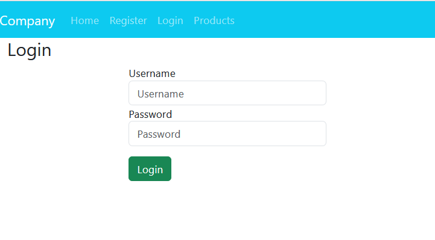

# Electronic_Market

Asp.Net MVC CRUD Operations. 
An electronic store management application that allows you to read, add, modify, delete, and search for data.
There are three different user levels: admin, manager, and regular user (who can be added using the registration form on the page). 
The management of users is done using ASP.NET Identity.

## Architecture

## How to run
1. Download or Clone the Project.
2. Run these command lines using the NuGet Package Manager Console:  
   . Install-Package jQuery  
   . Install-Package popper.js  
   . Install-Package Bootstrap  
3. Execute the SQL script found in the sql.txt file to create the database and tables
4. The database migration to create the user management tables is already available in the IdentityMigration folder; you just need to run the following command: 
  . Update-Database

## Screenshot

  
  

